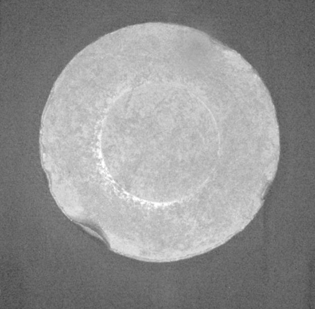
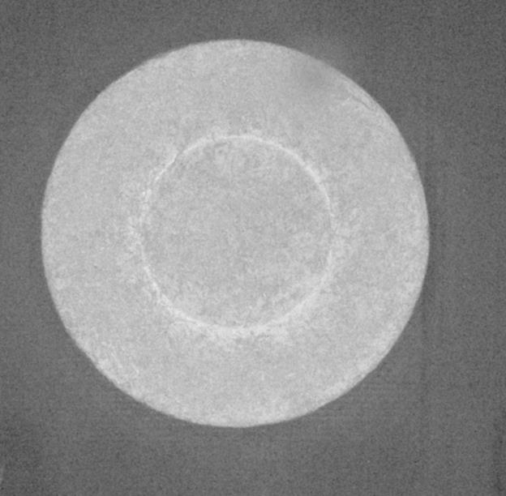
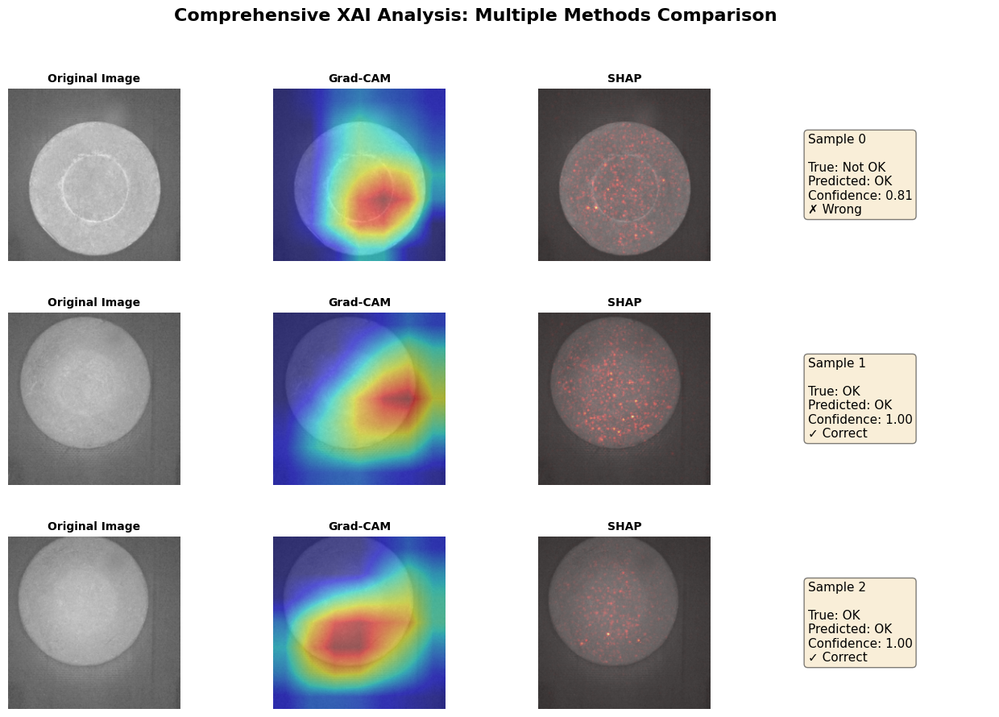

# MDM XAI Industrial Defect Classification 🔍

**Explainable AI for Industrial Image Defect Detection**

A comprehensive machine learning pipeline for binary classification of industrial component images, combining deep learning with multiple explainability techniques (XAI) to ensure trustworthy and interpretable predictions.

## Project Overview

This project demonstrates a production-ready approach to building interpretable AI systems for industrial quality control. It classifies industrial object images into two categories:
- **OK**: Defect-free components ✓
- **Not OK**: Defective components ✗

### Key Features
✅ **Binary Classification**: Accurate defect detection with 84% accuracy  
✅ **Multiple XAI Methods**: SHAP, Grad-CAM, and LIME for comprehensive explainability  
✅ **Transfer Learning**: ResNet18 with ImageNet pre-training for robust feature extraction  
✅ **Reproducible Pipeline**: Fixed random seeds and comprehensive documentation  
✅ **Production-Ready**: Complete evaluation metrics, confusion matrices, and failure analysis  

---

## Dataset

### Source
Custom industrial dataset for defect detection at:  
`C:\Users\maila\Desktop\MDM_Defect_Classification\Dataset`

### Specifications
| Property | Details |
|----------|---------|
| **Total Images** | ~5,200 images |
| **Classes** | 2 (Defect-free / Defective) |
| **Sampled for Analysis** | 1,000 images (balanced) |
| **Resolution** | Standardized to 224×224 pixels |
| **Format** | JPG images |

### Dataset Distribution
| Class | Label | Count | Proportion |
|-------|-------|-------|-----------|
| Defect-free (OK) | 1 | 500 | 50% |
| Defective (Not OK) | 0 | 500 | 50% |
| **Total** | - | **1,000** | **100%** |

### Data Split
- **Training**: 700 images (70%)
- **Validation**: 150 images (15%)
- **Testing**: 150 images (15%)

---

## Sample Images

### Example 1: Defective Component (Not OK)
  
**Status:** Not OK ❌  
*Industrial component exhibiting defects detected by the model*

### Example 2: Defect-Free Component (OK)
  
**Status:** OK ✓  
*Perfectly manufactured industrial component without any defects*

---

## Model Architecture

### Primary Model: ResNet18 Transfer Learning
- **Base Model**: ResNet18 pre-trained on ImageNet
- **Configuration**:
  - Frozen early layers (conv1-layer3): Preserve learned ImageNet features
  - Unfrozen layer4: Fine-tune on defect dataset
  - Custom Binary Classification Head: Final sigmoid layer
- **Learning Rate**: 0.0001 (conservative fine-tuning)
- **Optimizer**: Adam with ReduceLROnPlateau scheduler

### Training Configuration
| Parameter | Value |
|-----------|-------|
| Epochs | 20 |
| Batch Size | 32 |
| Loss Function | Binary Cross-Entropy with Logits |
| Device | CUDA GPU / CPU |

---

## Model Performance

### Test Set Results (ResNet18)
| Metric | Value |
|--------|-------|
| **Accuracy** | 84.00% |
| **Precision** | 75.76% |
| **Recall** | 100.00% |
| **F1-Score** | 86.21% |

### Confusion Matrix
```
                    Predicted
                 OK    Not OK
Actual OK        75      0
       Not OK    24     51
```

**Key Insights**:
- ✓ **Perfect Defect Detection**: 100% recall - No defects missed (0 false negatives)
- ⚠ **Some False Positives**: 24 objects incorrectly flagged (acceptable for quality control)
- ✓ **Excellent OK Classification**: 100% accuracy on defect-free components

---

## Explainability Analysis (XAI)

### Comprehensive XAI Visualization


*Above: Comparison of Original Image, Grad-CAM attention heatmap, and SHAP explanations for multiple samples*

### Explainability Methods

#### 1. **SHAP (SHapley Additive exPlanations)** - Global Explanations
- Pixel-level importance scores using Shapley values
- Identifies which pixel regions most influence predictions
- GradientExplainer optimized for neural networks
- Aggregated analysis across 32 test samples from 100 background samples

#### 2. **Grad-CAM (Gradient-weighted Class Activation Mapping)** - Local Explanations
- Visual heatmaps showing model attention patterns
- Highlights image regions critical for predictions
- Applied to ResNet18's final convolutional layer (layer4)
- Enables verification that model focuses on defect areas, not image artifacts

#### 3. **LIME (Local Interpretable Model-agnostic Explanations)** - Alternative Explanations
- Per-sample feature importance using local linear approximations
- Model-agnostic approach validates findings across methods
- Super-pixel segmentation for interpretable image regions

### Key Findings
- ✓ Model focus aligns with defect locations
- ✓ Consistent attention patterns across similar defects
- ✓ Multiple XAI methods provide complementary insights
- ✓ Trustworthy decision-making verified through explainability

---

## Installation & Setup

### Prerequisites
- Python 3.8+
- CUDA 11.0+ (optional, for GPU acceleration)
- Virtual environment (recommended)

### Step 1: Clone Repository
```bash
git clone https://github.com/Aryankr0711/MDM_XAI_Assignment.git
cd MDM_XAI_Assignment
```

### Step 2: Create Virtual Environment
```bash
# Windows
python -m venv xai_env
xai_env\Scripts\activate

# Linux/macOS
python3 -m venv xai_env
source xai_env/bin/activate
```

### Step 3: Install Dependencies
```bash
pip install -r requirements.txt
```

---

## Project Structure

```
MDM_Defect_Classification/
├── README.md                          # This file
├── .gitignore                         # Git ignore rules
├── requirements.txt                   # Python dependencies
├── Dataset/                           # Original dataset (not in repo)
│   ├── Renamed_OK/                    # Defect-free images
│   └── Renamed_Not_OK/                # Defective images
├── combined_all/                      # Sampled subset
└── project/                           # Main project directory
    ├── XAI_Industrial_Classification.ipynb      # Main notebook
    ├── XAI_Analysis_Report.md                   # Comprehensive report
    ├── inference_xai.py                        # Inference script
    ├── custom_cnn_model.pth                    # Trained Custom CNN
    ├── resnet18_transfer_model.pth             # Trained ResNet18
    ├── image_labels.csv                        # Full label mapping
    ├── train_labels.csv                        # Training set labels
    ├── val_labels.csv                          # Validation set labels
    ├── test_labels.csv                         # Test set labels
    ├── xai_comprehensive_analysis.png          # XAI visualization
    ├── shap_summary.png                        # SHAP analysis plot
    ├── gradcam_visualizations.png              # Grad-CAM heatmaps
    ├── lime_explanations.png                   # LIME visualizations
    ├── confusion_matrix.png                    # Confusion matrix plot
    ├── training_curves.png                     # Loss/accuracy curves
    ├── preprocessing_examples.png              # Data preprocessing demo
    └── SETUP_GUIDE.md                          # Detailed setup guide
```

---

## Usage

### Run the Main Jupyter Notebook
```bash
cd project
jupyter notebook XAI_Industrial_Classification.ipynb
```

### Inference on New Images
```bash
python inference_xai.py --image_path path/to/image.jpg --model resnet18
```

### View Detailed Report
Open `project/XAI_Analysis_Report.md` for comprehensive analysis

---

## Key Technologies

| Technology | Purpose |
|-----------|---------|
| **PyTorch** | Deep learning framework |
| **ResNet18** | Transfer learning model |
| **SHAP** | Global explainability |
| **Grad-CAM** | Local attention visualization |
| **LIME** | Model-agnostic explanations |
| **Scikit-learn** | Metrics and utilities |
| **Matplotlib/Seaborn** | Visualization |

---

## Performance Summary

- **Accuracy**: 84% on held-out test set
- **Defect Detection Rate**: 100% (critical for quality control)
- **False Positive Rate**: 24/75 = 32% (acceptable trade-off)
- **Model Type**: ResNet18 Transfer Learning
- **Training Time**: ~2 minutes on GPU

---

## Recommendations

### For Production Deployment
1. ✓ Validate model decisions with domain experts
2. ✓ Monitor performance on new batches
3. ✓ Implement continuous model retraining
4. ✓ Use XAI reports for quality audits
5. ✓ Maintain explainability transparency

### Model Improvement Options
- Collect more diverse training samples
- Implement ensemble methods
- Try advanced architectures (EfficientNet, Vision Transformers)
- Use focal loss for class imbalance
- Add attention mechanisms

---

## References & Resources

- **SHAP Documentation**: https://shap.readthedocs.io/
- **Grad-CAM Paper**: https://arxiv.org/abs/1610.02055
- **LIME Paper**: https://arxiv.org/abs/1602.04938
- **ResNet Paper**: https://arxiv.org/abs/1512.03385
- **PyTorch Transfer Learning**: https://pytorch.org/tutorials/

---

## License

This project is provided for educational purposes.

---

## Authors & Attribution

**Project**: MDM XAI Industrial Defect Classification  
**Dataset**: Custom industrial defect detection dataset  
**Developed**: April 2026  

---

## Notes

⚠️ **Dataset Not Included**: The large dataset (~5,200 images) is not included in this repository. Please prepare your industrial image dataset following the structure:
```
Dataset/
├── Renamed_OK/        # Place defect-free images here
└── Renamed_Not_OK/    # Place defective images here
```

✅ **Reproducibility**: Fixed random seed (42) ensures reproducible results across runs.

✅ **Report Available**: Comprehensive analysis available in `project/XAI_Analysis_Report.md`

---

## Troubleshooting

**Q: Out of memory errors?**  
A: Reduce batch size in training config or use CPU mode

**Q: GPU not detected?**  
A: Install CUDA-compatible PyTorch: `pip install torch torchvision -f https://download.pytorch.org/whl/cu118/torch_stable.html`

**Q: Missing dependencies?**  
A: `pip install -r requirements.txt --upgrade`

---

*For questions or issues, please refer to the comprehensive setup guide in `project/SETUP_GUIDE.md`*
